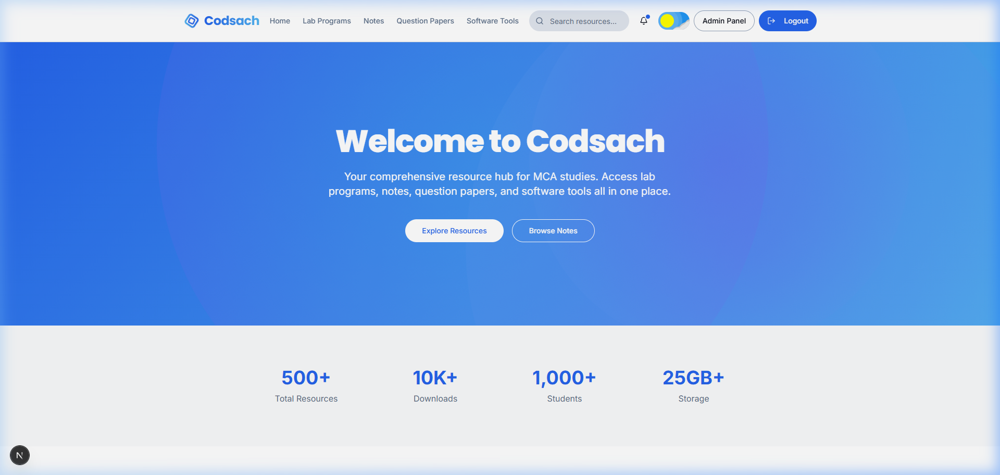
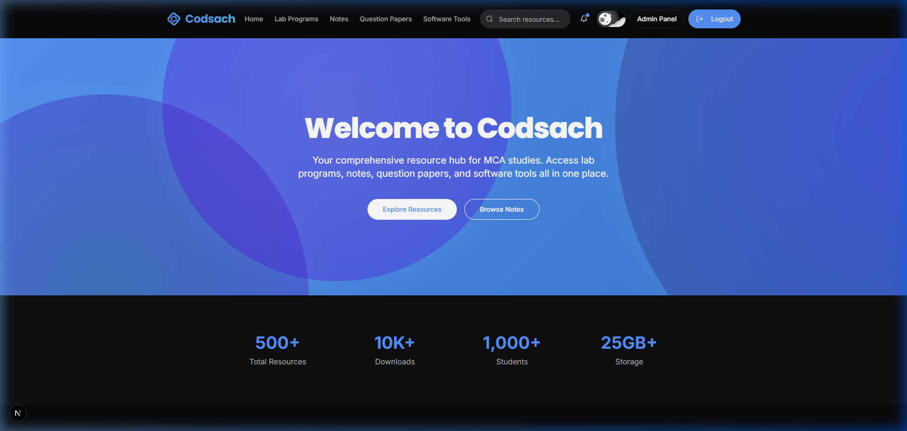

# Codsach - Student Resource Hub

Codsach is a modern, full-stack web application designed as a comprehensive resource hub for MCA (Master of Computer Applications) students and developers. It organizes academic materials such as lab programs, study notes, question papers, and essential software tools, all dynamically managed through a GitHub repository and a user-friendly admin panel.

## 📸 Screenshots

| Light Theme | Dark Theme |
| --- | --- |
|  |  |

## ✨ Features

- **Resource Categories**: Structured access to **Lab Programs** (source code), **Notes** (study material), **Question Papers** (previous years), and **Software Tools** (direct downloads).
- **Dynamic Controls**: Live filtering by subject, semester, or year, and sorting by name, date, or download counts.
- **Admin Management**: Secure dashboard for uploading new resources, editing details, and deleting files.
- **Git-Backed Storage**: Resources are committed and managed directly in a public GitHub repository, ensuring transparent version control.
- **Real-Time Notifications**: Smart alert system in the navbar indicating newly uploaded resources (within the last 7 days).
- **Modern UI/UX**: Aesthetic interfaces with light/dark theme toggling, hover transitions, and responsive layouts.
- **SEO & Analytics**: Fully search-engine optimized (dynamic sitemaps/metadata) and integrated with Vercel Analytics.

## 🛠️ Tech Stack

- **Framework**: [Next.js](https://nextjs.org/) (App Router)
- **Language**: [TypeScript](https://www.typescriptlang.org/)
- **Styling**: [Tailwind CSS](https://tailwindcss.com/) & [Shadcn UI](https://ui.shadcn.com/)
- **AI & Flows**: [Firebase Genkit](https://firebase.google.com/docs/genkit) (utilizing Google AI / Gemini)
- **Content Storage**: [GitHub API](https://docs.github.com/en/rest)
- **Analytics**: [Vercel Analytics](https://vercel.com/analytics)
- **Deployment**: [Vercel](https://vercel.com/)

## 📂 Project Structure

```
/
├── src/
│   ├── app/                  # Application routing (App Router)
│   │   ├── (app)/            # Main student sections (notes, lab programs, search, etc.)
│   │   ├── admin/            # Secure admin control dashboard
│   │   └── login/            # Admin authentication page
│   ├── ai/                   # Firebase Genkit configuration & workflow flows
│   │   ├── flows/            # Backend upload, delete, and list flows
│   │   └── genkit.ts         # AI initialization
│   ├── components/           # UI and layout component libraries
│   │   ├── auth/             # Login and authentication forms
│   │   ├── landing/          # Hero, stats, footer, and CTA components
│   │   ├── resources/        # Resource cards, search lists, and categories
│   │   └── ui/               # Base Shadcn design system components
│   ├── hooks/                # Custom React hooks (e.g. mobile detection, toasts)
│   └── lib/                  # Shared utilities (Tailwind merges, formatting)
├── public/                   # Static assets (images, logos, favicon, robots.txt, sitemaps)
└── package.json              # Script and dependency configuration
```

## ⚙️ Getting Started

### Prerequisites
- [Node.js](https://nodejs.org/) (v18 or later)
- [npm](https://www.npmjs.com/) or [yarn](https://yarnpkg.com/)
- A [GitHub Personal Access Token](https://github.com/settings/tokens/new) (with `repo` scope)

### Installation

1. **Clone the repository:**
   ```bash
   git clone https://github.com/Codsach/codsach-student-hub.git
   cd codsach-student-hub
   ```

2. **Install dependencies:**
   ```bash
   npm install
   ```

3. **Configure Environment Variables:**
   Create a `.env.local` file in the root directory:
   ```env
   # Personal Access Token for GitHub repository management
   GITHUB_TOKEN=ghp_your_github_token_here

   # Google AI Studio API Key for Genkit flows
   GEMINI_API_KEY=your_gemini_api_key_here
   ```

4. **Change Target Resource Repository (Optional):**
   By default, the application reads/writes resources to `Codsach/codsach-resources`. If you want to use your own GitHub repository for storage, update the repository name parameter in the flow calls inside:
   - `src/app/(app)/**/page.tsx`
   - `src/app/(app)/admin/page.tsx`
   - `src/app/(app)/search/page.tsx`

5. **Run the local server:**
   ```bash
   npm run dev
   ```
   Open [http://localhost:9002](http://localhost:9002) in your browser.

## 🔐 Admin Access

The admin panel is accessible at [http://localhost:9002/login](http://localhost:9002/login) using the default credentials:
- **Email**: `admin@codsach.com`
- **Password**: `codsach@22`

## 🌐 Deployment

This project is fully optimized for Vercel:
1. Push your code to your GitHub repository.
2. Import the project on [Vercel](https://vercel.com/).
3. Add `GITHUB_TOKEN` and `GEMINI_API_KEY` to the Environment Variables in the project settings.
4. Deploy. Vercel Analytics will auto-enable if toggled in the dashboard.

## 🤝 Contributing

Contributions make the developer community an amazing place. Feel free to fork the repository, open issues, or submit pull requests for suggestions, bug fixes, or enhancements.